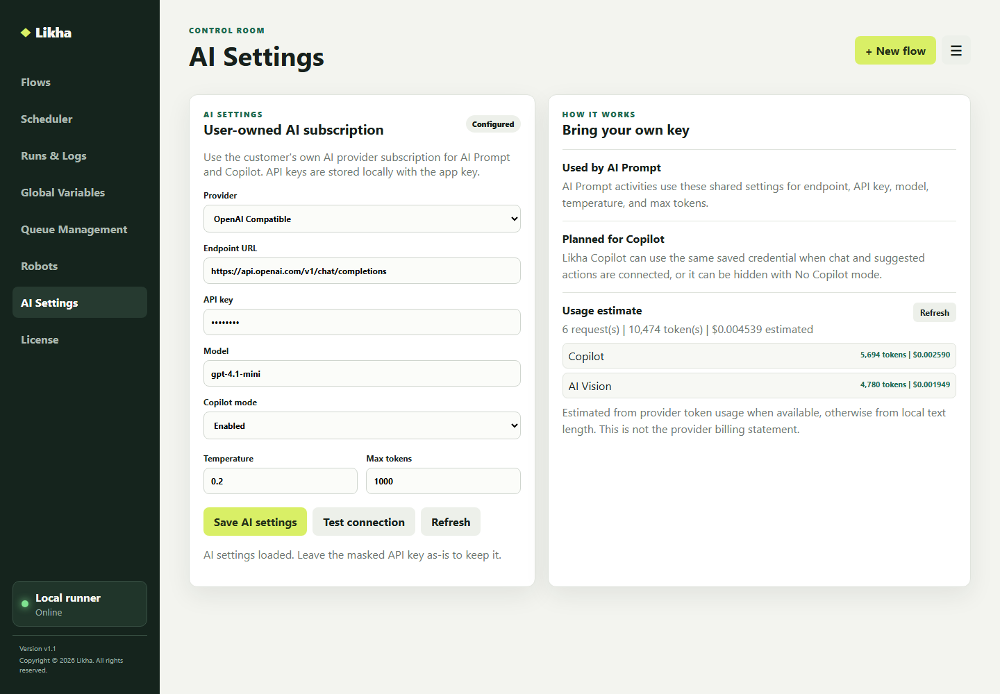

# AI Vision



**Activity group:** AI Capabilities

## Purpose

Analyzes an image file with the configured AI model and saves the result to a workflow variable.

Use this for screenshots, receipts, forms, charts, labels, barcodes, QR codes, or image-based document checks.

## Properties

- `image_file`: Path to the image file.
- `output_type`: What the model should return. Options are `object`, `text`, `description`, `table`, `chart`, `barcode`, and `QR`.
- `output`: Output variable for the result.
- `status_code`: Output variable for the HTTP status code.

## Output Types

- `description`: Text description of the image.
- `text`: Text found or inferred from the image.
- `object`: JSON object describing the image contents.
- `table`: DataTable-style table output when the image contains a table.
- `chart`: JSON object describing chart data and meaning.
- `barcode`: Decoded barcode text and symbology when visible.
- `QR`: Decoded QR text and symbology when visible.

## Example

```txt
image_file: C:\Invoices\invoice-scan.png
output_type: object
output: AIVisionOutput
status_code: AIVisionStatusCode
```

## Notes

Use a clear image with readable text or visible objects. If the image contains a table and the next step needs rows, consider [AI Table Extract](AI%20Table%20Extract.md).

