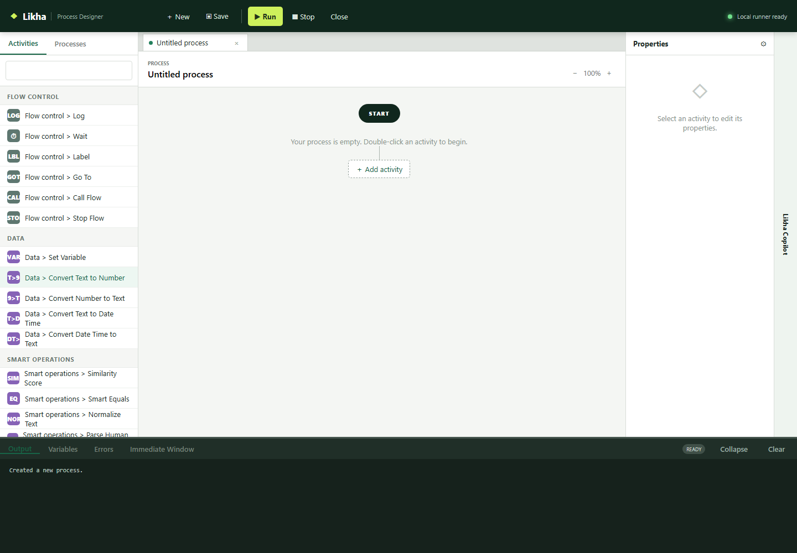

# For Each



**Activity group:** Loop

## Purpose

Loops through every item in a DataTable/List variable.

## Properties

- `source`: DataTable/List variable to loop.
- `item`: Variable name for current row/item.
- `index`: Variable name for zero-based index.
- `body_steps`: Activities to run for each item.

## Notes

- For a DataTable row object, use `current_row["Column Name"]`.
- For list-like rows, use indexes such as `current_row[0]`.

## Example

```txt
source: names_dt
item: current_row
index: current_index
Log: {{current_row["Last Name"]}}
```
