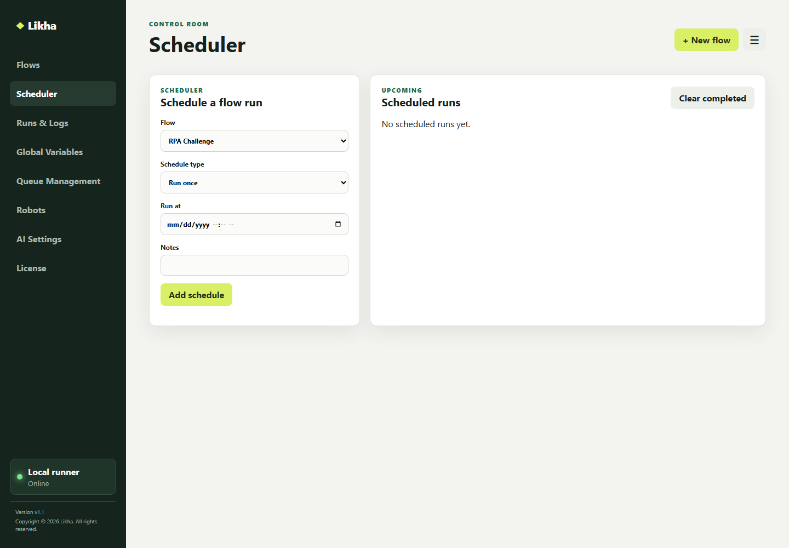
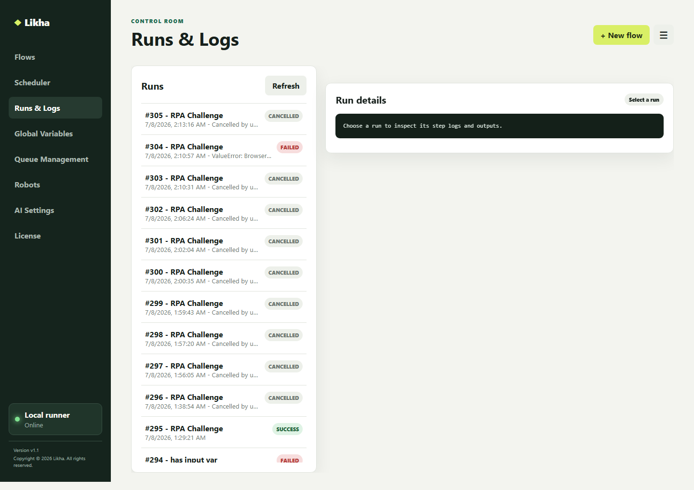

# Quick Start

## Build And Run A Flow

1. Start Likha with `run_desktop.bat`.
2. Open Process Designer.
3. Add activities from the left activity library.
4. Configure each activity in Properties.
5. Save the flow.
6. Click Run to execute in designer mode.
7. Review the output panel and run logs.

## Control Room

Control Room is the operational area for managing saved workflows, schedules, queues, robots, logs, and platform settings.

## Flows

Use Flows to create, edit, save, and run processes.

## Scheduler

Use Scheduler to run saved workflows at a configured time or recurrence.

Scheduler-created runs are unattended jobs.

## Run Logs

Use Run Logs to review:

- Run status
- Step logs
- Errors
- Output variables
- Robot execution details

## Global Variable

Use Global Variables to store shared values that workflows can read at runtime.

Typical examples:

- Environment names
- API base URLs
- Shared folder paths
- Non-secret configuration values

## Queue Management

Use Queue Management to create queues, add queue items, process pending work, and update item status.

See:

[Queue Management.md](Activities/Files%20Queues%20API%20and%20Scripting/Queue%20Management.html)

## Robots

Use Robots to monitor robot resources, heartbeats, user agents, robot jobs, and event triggers.

See:

- [Robot Service and User Agent.md](Robot%20Service%20and%20User%20Agent.html)
- [Distributed Control Room and VM Robot Setup.md](Distributed%20Control%20Room%20and%20VM%20Robot%20Setup.html)
- [Event Triggers.md](Activities/Event%20Triggers/Event%20Triggers.html)

## AI Settings

Use AI Settings to configure the provider, endpoint URL, API key, model, temperature, and max tokens used by AI activities.

See:

[AI Prompt.md](Activities/AI%20Capabilities/AI%20Prompt.html)

## License

Licensing is currently represented as a placeholder page:

[18 - Licensing.md](18%20-%20Licensing.html)

