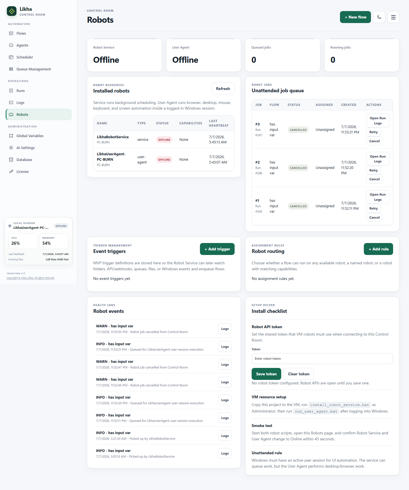

<nav class="doc-home-link"><a href="{{ '/docs/' | relative_url }}">&larr; Go back Home</a></nav>

# Orchestrator

The Likha orchestrator capabilities live in Control Room and the robot runtime.



## Responsibilities

- Store flows.
- Start designer runs.
- Queue unattended robot jobs.
- Manage schedules.
- Manage event triggers.
- Track robot heartbeats.
- Track run logs and output.
- Store queues and queue item statuses.

## Unattended Setup

Unattended execution uses:

- `LikhaRobotService`
- `LikhaUserAgent`
- Control Room robot jobs
- Robot resources and heartbeats

See:

[Robot Service and User Agent.md](Robot%20Service%20and%20User%20Agent.html)

## Robots In Control Room

Open:

```text
Control Room > Robots
```

Use this page to inspect:

- Robot service status
- User agent status
- VM robot resources
- Heartbeats
- Robot jobs
- Event triggers

## Distributed VM Setup

For a central Control Room and separate robot VMs, see:

[Distributed Control Room and VM Robot Setup.md](Distributed%20Control%20Room%20and%20VM%20Robot%20Setup.html)

## Runtime Rule

Designer Run is for building and testing flows locally.

Robot jobs are for schedules, event triggers, and unattended execution.
