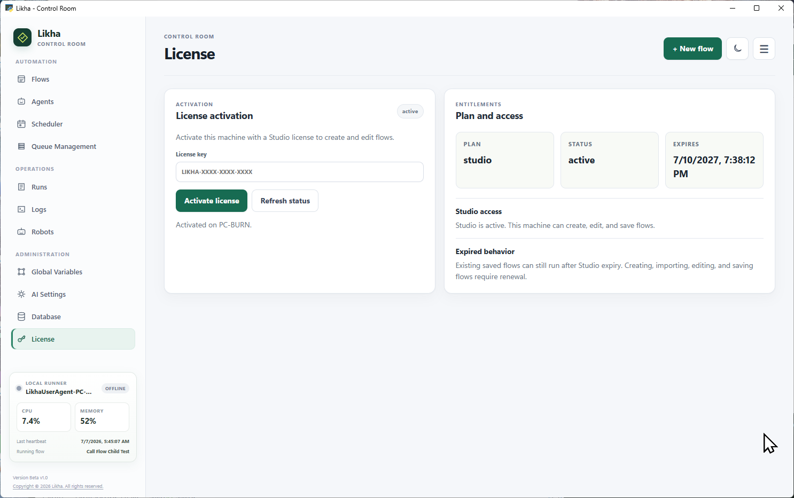

# Licensing

Placeholder.

This page will describe Likha licensing once the final licensing model, activation process, offline behavior, and support terms are ready.

Expected future sections:

- License type
- Activation
- Offline activation
- Robot/runtime entitlement
- Updates
- Support
- Trial or evaluation rules
