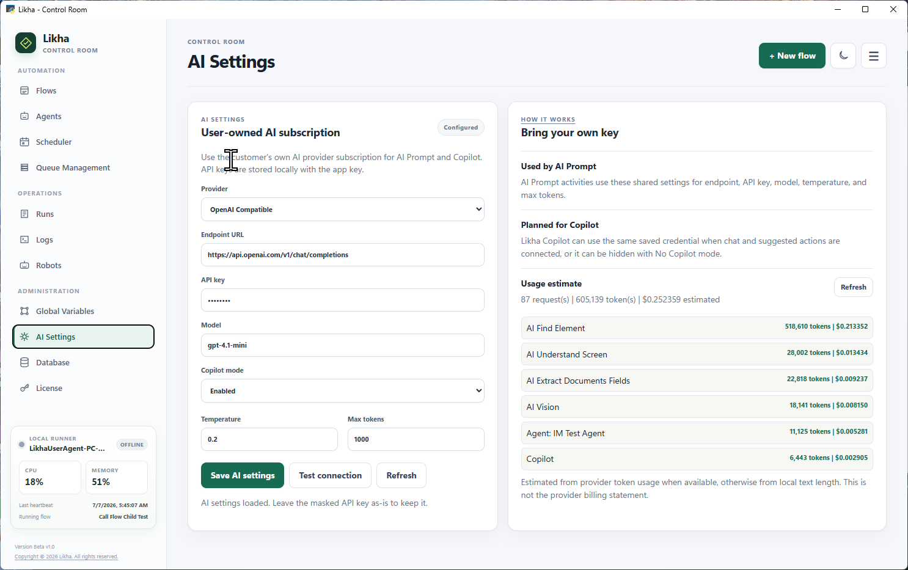

<nav class="doc-home-link"><a href="https://burnimjerome.github.io/LIKHA-_-BETA/">&larr; Go back Home</a></nav>

# AI Capabilities



**Activity group:** AI Capabilities

## Purpose

AI Capabilities are workflow activities that call the shared AI provider configured in Control Room > AI Settings. They let a flow summarize text, return structured JSON, extract document fields, understand images, extract tables, and answer questions from local or linked knowledge sources.

## Available Activities

- [AI Prompt](AI%20Prompt.html): send a custom system instruction and prompt.
- [AI Extract Documents Fields](AI%20Extract%20Documents%20Fields.html): extract named fields from document text or readable files.
- [AI Vision](AI%20Vision.html): analyze an image and return text, JSON, table, chart, barcode, or QR output.
- [AI Table Extract](AI%20Table%20Extract.html): extract a table from a PDF or image into a DataTable.
- [AI Knowledge Search (RAG)](AI%20Knowledge%20Search%20RAG.html): answer a question using a file, folder, or link as the knowledge source.

## Shared Configuration

Open:

```text
Control Room > AI Settings
```

Configure:

- Provider
- Endpoint URL
- API key
- Model
- Temperature
- Max tokens

The activities use these settings at runtime. Do not place API keys inside individual workflow steps.

## Common Flow Pattern

1. Configure Control Room > AI Settings.
2. Prepare the input text, file path, image path, folder, or link.
3. Add the AI activity in Process Designer.
4. Set output variable names for the result and status code.
5. Use the output variable in later activities such as If Else, Excel Write, Queue Add Item, Display Message, or API Request.

## Outputs

AI activities normally expose:

- A result output, such as `AIText`, `ExtractedFieldsJson`, `AIVisionOutput`, `ExtractedTable`, or `AIKnowledgeAnswer`.
- A `StatusCode` output for the HTTP response code.
- Some activities also expose source or JSON outputs for downstream processing.

## Error Handling

Activities that expose retry settings support:

- `retry`: try again when the activity fails.
- `retry_count`: number of retry attempts.
- `retry_interval`: seconds between retries.
- `on_error`: stop, resume next, or go to a label.
- `error_label`: target label when `on_error` is Go To.

