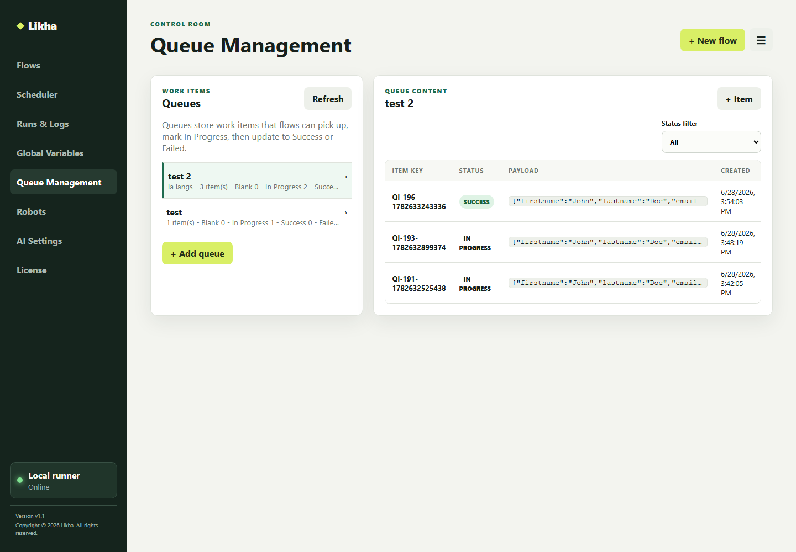

# If File Exists



**Activity group:** File Actions

## Purpose

Checks whether a file exists and stores true or false.

## Properties

- `file_path`: File path to check.
- `output`: Boolean result variable.

## Example

```txt
file_path: C:\Input\report.xlsx
output: FileExist
If Else operation: FileExist == true
```

## Error handling

Activities that expose retry settings support:

- `retry`: try again when the activity fails.
- `retry_count`: number of retry attempts.
- `retry_interval`: seconds between retries.
- `on_error`: stop, resume next, or go to a label.
- `error_label`: target label when `on_error` is Go To.
