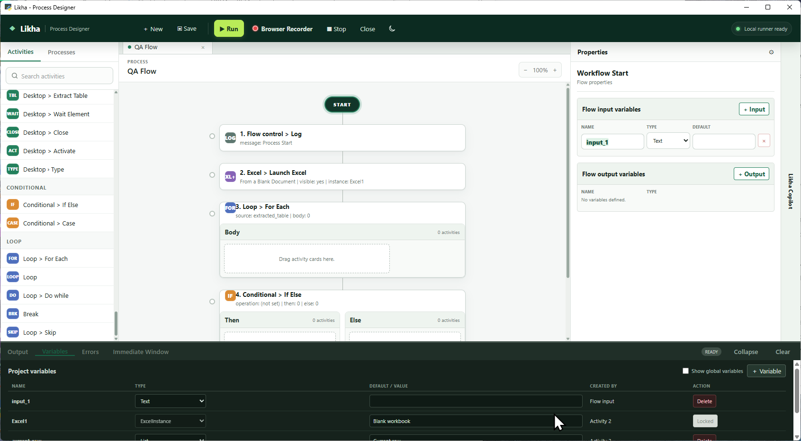

<nav class="doc-home-link"><a href="https://burnimjerome.github.io/LIKHA-_-BETA/">&larr; Go back Home</a></nav>

# Smart Operations Activities

Smart Operations are local rule-based helpers for fuzzy matching, text normalization, number parsing, currency comparison, format detection, and invoice-number extraction. They do not call an AI provider and do not require Control Room AI Settings.

## Activities

- [Smart Operations Overview](Smart%20operations.html)
- [Similarity Score](Similarity%20Score.html)
- [Smart Equals](Smart%20Equals.html)
- [Normalize Text](Normalize%20Text.html)
- [Parse Human Number](Parse%20Human%20Number.html)
- [Compare Currency](Compare%20Currency.html)
- [Detect Number Format](Detect%20Number%20Format.html)
- [Fuzzy Company Match](Fuzzy%20Company%20Match.html)
- [Extract Invoice Number](Extract%20Invoice%20Number.html)

## When To Use

Use Smart Operations when deterministic local logic is enough. Use [AI Capabilities](../AI%20Capabilities/README.html) when the flow needs language understanding, image analysis, document extraction, table extraction from complex layouts, or knowledge-source answering.

