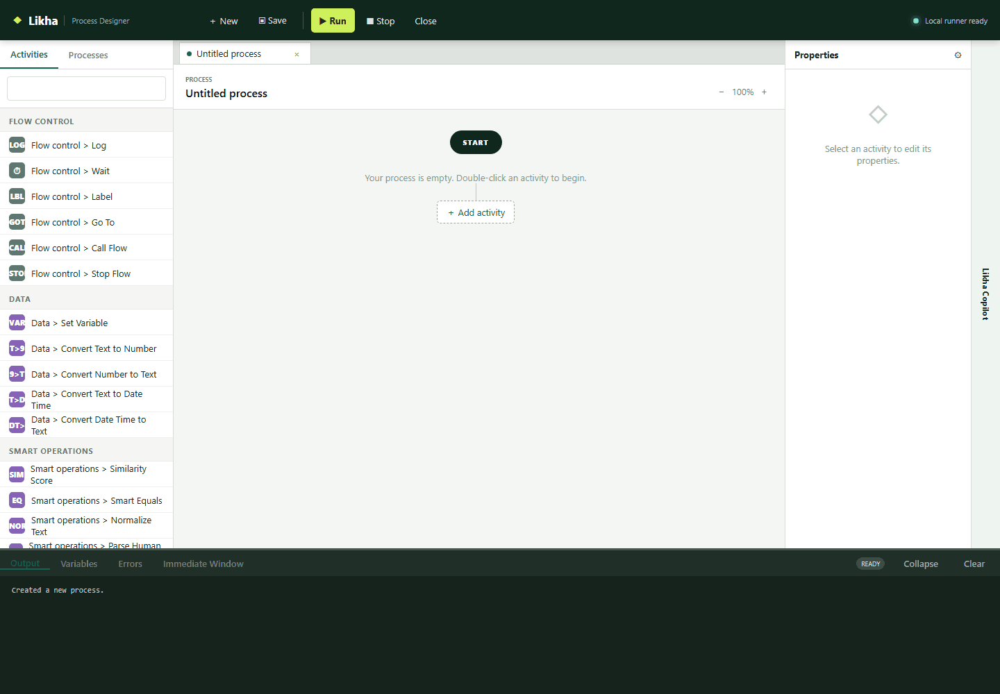
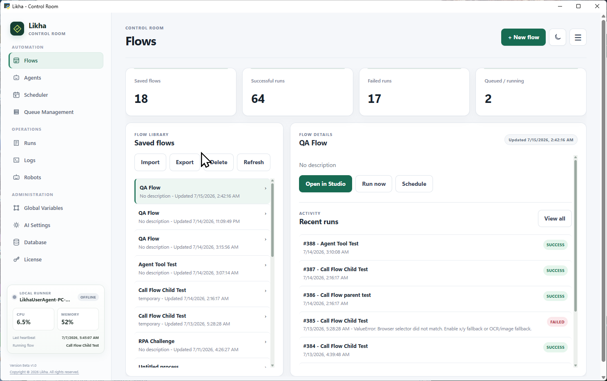

<nav class="doc-home-link"><a href="https://burnimjerome.github.io/LIKHA-_-BETA/">&larr; Go back Home</a></nav>

# Likha RPA

Likha is a Windows-first RPA platform for building, running, and managing automation workflows across desktop apps, browsers, Excel, files, queues, APIs, scripts, and AI-powered tasks.

It is designed for teams that want practical automation without being forced into a large enterprise platform before they are ready.

## Download

Download link placeholder:

[Download Likha Installer](https://github.com/BurnIMJerome/LIKHA-_-BETA/tree/main/docs/installer-output)

Beta Version Release Note:  FOR LICENSE KEY Request - Send me an email at Jearomev@yahoo.com 

## What Likha Does

Likha helps users automate repetitive work by combining a low-code process designer with a Control Room and robot runtime.

Core capabilities:

- Build flows visually in Process Designer.
- Run flows interactively during development.
- Schedule unattended runs.
- Process queue items.
- Monitor run logs and robot jobs.
- Use AI Capabilities for prompts, document extraction, vision, table extraction, and knowledge search.
- Use Smart Operations for local fuzzy matching, parsing, normalization, and extraction.
- Automate Windows desktop applications.
- Automate modern browsers.
- Read and write Excel workbooks.
- Work with files, folders, APIs, scripts, and data tables.
- Connect AI providers through Control Room AI Settings.
- Run robots on local machines or separate VM resources.

## Product Highlights

### Desktop Automation

Automate Windows applications using selectors, OCR/image fallback, hotkeys, screenshots, text extraction, table extraction, and hardware input when needed.

Start here:

[Desktop Automation](08%20-%20Desktop%20Automation.html)

### Browser Automation

Automate websites using BrowserInstance variables, selector picking, highlighting, clicks, filling, screenshots, table extraction, OCR/image matching, and JavaScript execution.

Start here:

[Browser Automation](09%20-%20Browser%20Automation.html)

### Excel Automation

Launch Excel, read ranges, write ranges, read and write cells, execute macros, get worksheet names, and inspect last used rows and columns.

Start here:

[Excel Automation](11%20-%20Excel%20Automation.html)

### Control Room

Use Control Room to manage flows, schedules, run logs, global variables, queues, robots, AI settings, and licensing.

Start here:

[Quick Start](07%20-%20Quick%20Start.html)

### Unattended Robots

Run scheduled and triggered jobs through `LikhaRobotService` and `LikhaUserAgent`, including distributed VM robot setups.

Start here:

[Orchestrator](17%20-%20Orchestrator.html)

### AI Integration

Bring your own AI provider and configure it in Control Room. Likha provides workflow activities for prompting, document field extraction, vision, table extraction, and knowledge search without forcing a separate AI platform subscription.

Start here:

[AI Integration](10%20-%20AI%20Integration.html)

## Advantages

## Start Small

Likha can run as a local desktop automation studio. A user can install it, build a flow, and run it on one machine without needing a server or enterprise orchestrator.

## Scale When Needed

When the automation program grows, Likha can expand into schedules, queues, Control Room, robot jobs, and VM robots.

## Own The Runtime

Likha is designed for teams that want control over where automation runs: local machine, on-premise server, VM robot, or private infrastructure.

## Bring Your Own AI

Likha connects to the AI provider configured by the user. The platform does not need to sit between the user and the provider as a markup layer.

## Practical Activity Coverage

Likha focuses on the activities automation builders use every day:

- Browser
- Desktop
- Excel
- Files
- Queues
- APIs
- Scripts
- Data tables
- Flow control
- Mouse and keyboard
- Monitor
- Message boxes
- AI
- Event triggers

## Product Vision

Likha's vision is to make automation accessible, practical, and owned by the people who build it.

The product direction is:

- Keep the designer approachable.
- Keep activity behavior clear and predictable.
- Support real-world Windows automation.
- Let teams start locally and scale gradually.
- Keep orchestration optional until it is needed.
- Support private infrastructure and distributed robot setups.
- Let users choose their AI provider.
- Build a product that small teams can afford and developers can enjoy using.

## Documentation Map

- [01 - Founder's Manifesto](01%20-%20Dev's%20Manifesto.html)
- [02 - Product Overview](02%20-%20Product%20Overview.html)
- [03 - Why Likha](03%20-%20Why%20Likha.html)
- [04 - Architecture](04%20-%20Architecture.html)
- [05 - Features](05%20-%20Features.html)
- [06 - Installation Guide](06%20-%20Installation%20Guide.html)
- [07 - Quick Start](07%20-%20Quick%20Start.html)
- [08 - Desktop Automation](08%20-%20Desktop%20Automation.html)
- [09 - Browser Automation](09%20-%20Browser%20Automation.html)
- [10 - AI Integration](10%20-%20AI%20Integration.html)
- [11 - Excel Automation](11%20-%20Excel%20Automation.html)
- [12 - Data and Data Table Activities](12%20-%20Data%20and%20Data%20Table%20Activities.html)
- [13 - Flow Control and Loops](13%20-%20Flow%20Control%20and%20Loops.html)
- [14 - Input, Monitor, and Message Activities](14%20-%20Input,%20Monitor,%20and%20Message%20Activities.html)
- [15 - Files, Queues, API, and Scripting](15%20-%20Files,%20Queues,%20API,%20and%20Scripting.html)
- [16 - Event Triggers](16%20-%20Event%20Triggers.html)
- [17 - Orchestrator](17%20-%20Orchestrator.html)
- [18 - Licensing](18%20-%20Licensing.html)
- [19 - Roadmap](19%20-%20Roadmap.html)
- [20 - FAQ](20%20-%20FAQ.html)

Grouped activity documentation:

[Activities](05%20-%20Features.html)

Image repository:

[images](images/README.html)

## Release Notes

### Current MVP

This documentation set describes the current MVP state of Likha.

Included areas:

- Process Designer
- Control Room
- Desktop automation
- Browser automation
- Excel automation
- Queue Management
- Scheduler
- Robot service and user agent
- Event triggers
- AI settings, AI Prompt, AI Vision, document extraction, table extraction, and knowledge search
- Data Table activities
- Flow control and loop activities
- File, API, scripting, monitor, message, and keyboard/mouse activities

Recent improvements documented in this build:

- Designer runs are separated from unattended robot queueing.
- Desktop Click OCR/image fallback is scoped and prioritized when selected.
- Browser selector picking prefers stable attributes such as `name` when IDs are dynamic.
- Send Keys resolves workflow expressions such as `current_row["First Name"]`.
- Excel Read Range normalizes blank cells and removes empty rows/trailing columns.
- Activity documentation is grouped under `Documentation/Activities`.

### Upcoming

Planned documentation and product areas:

- Final licensing details
- Installer download link
- More complete robot assignment rules
- Artifact upload and screenshot collection from robot runs
- Production database setup
- Security hardening guide
- Role-based access and administration guide

## Useful Starting Points

New users:

[Quick Start](07%20-%20Quick%20Start.html)

Builders:

[Activities](05%20-%20Features.html)

Administrators:

[Architecture](04%20-%20Architecture.html)

Robot VM setup:

[Distributed Control Room and VM Robot Setup](Distributed%20Control%20Room%20and%20VM%20Robot%20Setup.html)
